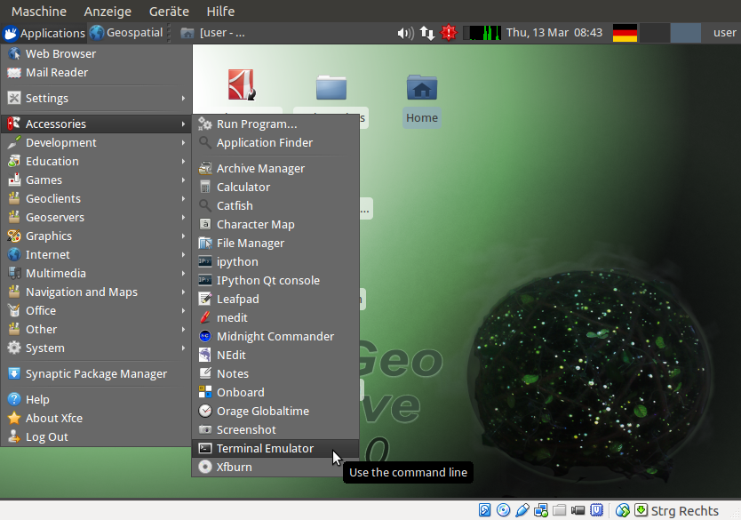
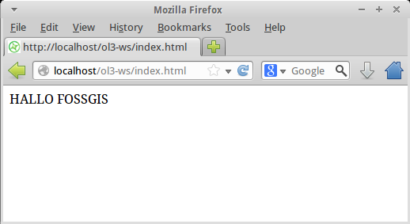

.. _setup:

Vorarbeiten & Umgebung
======================

OSGeo-Live 7.0
--------------

Die Schulung während der FOSSGIS findet auf der OSGeo-Live-Linux-Distribution
statt, die unter anderem einen Apache-Webserver mitbringt.

Wir werden uns ein Verzeichnis erzeugen, in welchem wir später die Workshopdaten
einfügen und in dem Sie Ihre HTML-Seiten abspeichern können.

Öffnen Sie ein Terminal um Shell-Befehle auf dem Live-System auszuführen:

"Applications - Accessoires - Terminal Emulation"

   
    Öffnen des Terminals

Geben Sie im Terminal zunächst folgenden Befehl ein:

    .. code-block:: sh

        sudo mkdir -p /var/www/ol3-ws

Das anschließend geforderte ``sudo`` Passwort des Benutzers ``user`` ist
``user``.

    .. code-block:: sh

        sudo chown user:user /var/www/ol3-ws

Wir versuchen nun, dort eine HTML-Datei anzulegen, und mit einem Browser zu
öffnen:

    .. code-block:: sh

        echo "HALLO FOSSGIS" > /var/www/ol3-ws/index.html

Wenn alles geklappt hat, sollte ein Aufruf der folgenden URL sollte eine
entsprechende Begrüßung anzeigen:

http://localhost/ol3-ws/index.html

   
    Hallo FOSSGIS.

ol3-Bibliothek und Demodaten
----------------------------

Als nächstes werden wir uns die ol3-Bibliothek und die benötigten Workshop-Daten
besorgen. Wechseln Sie zunächst in das oben angelegte Verzeichnis:

    .. code-block:: sh

        cd /var/www/ol3-ws/

Anschließend laden Sie bitte die Datei master.zip herunter und entpacken Sie das
zip-Archiv in dem aktuellen Verzeichnis:

    .. code-block:: sh

        wget "https://github.com/bartvde/ol3-training/archive/master.zip"
        unzip master.zip

Es sollte sich nunmehr ein neues Verzeichnis ``ol3-training-master/`` im
aktuellen Verzeichnis befinden. Alle Beispiele, die Sie im Rahmen dieses
Workshops erstellen, sollten sich innerhalb dieses Ordners befinden.

Deutsche Tastaturbelegung
-------------------------

Falls Ihre OSGeo-Live-Linux-Distribution ein amerikanisches Tastaturlayout
hat, können Sie dieses mittels des Befehls

    .. code-block:: sh

        setxkbmap de

in einem Terminal (s.o.) auf ein deutsches Tastaturlayout umstellen.

Alles erledigt?
---------------

Gut, dann können wir nun mit :doc:`/basics/index` weitermachen.
